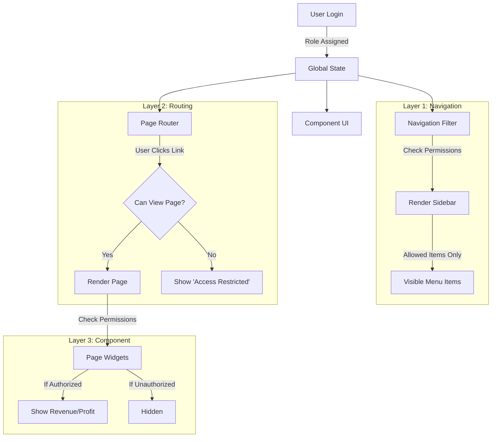
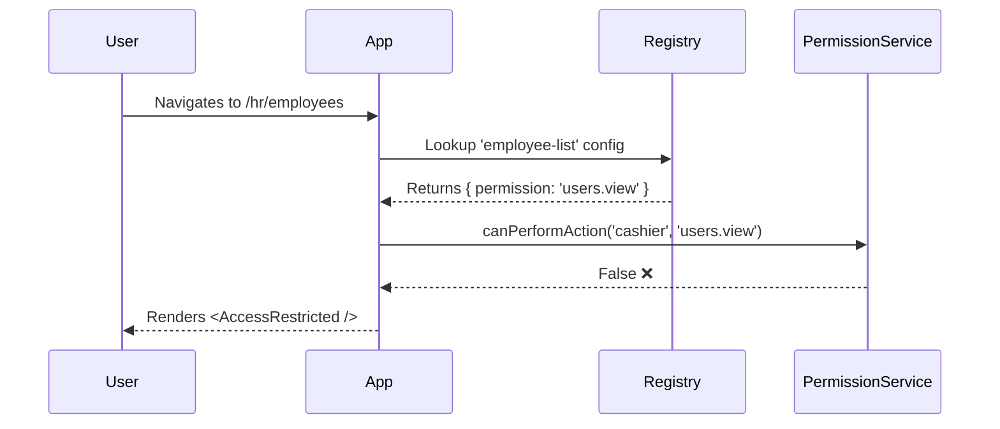

# RBAC Security Implementation Review

This document provides a comprehensive, sequential overview of the Role-Based Access Control (RBAC) implementation in PharmaFlow AI. It details the architectural decisions, layers of security, and specific code changes made to secure the application.

## 🎯 Objective

To enforce strict access control where users (e.g., _Cashiers_, _Pharmacists_) can only access features and data necessary for their specific roles, preventing unauthorized actions like deleting inventory, viewing financial reports, or modifying system settings.

---

## 🏗️ Architecture & Flow

The RBAC system is built on a **3-Layer Security Model**:

1.  **Routing Layer (Hard Stop)**: Prevents loading the page component entirely.
2.  **Navigation Layer (UX)**: Hides links to pages the user cannot access.
3.  **Component Layer (Contextual)**: Disables specific buttons or hides sensitive widgets within a page.

### High-Level Flow Diagram



---

## 📝 Sequential Implementation Steps

### Phase 1: The Foundation (`permissions.ts`)

We established a central "source of truth" for roles and capabilities.

- **File**: `config/permissions.ts`
- **Key Concepts**:
  - `UserRole`: Defined literals (`'admin' | 'pharmacist' | 'cashier' ...`)
  - `PermissionAction`: Granular strings (`'inventory.view'`, `'users.manage'`, `'reports.view_financial'`)
  - `ROLE_PERMISSIONS`: A dictionary mapping every Role to its allowed Permissions.
  - `canPerformAction()`: The pure function used everywhere to check access.

```typescript
// Example from permissions.ts
export const ROLE_PERMISSIONS = {
  cashier: ['sale.create', 'sale.checkout', ...],
  admin: [...ALL_PERMISSIONS]
};
```

### Phase 2: Page-Level Security (Routing)

We ensured that even if a user guesses a URL (e.g., `/hr/employee-list`), they cannot access it.

- **Files**: `config/pageRegistry.ts`, `App.tsx`
- **Action**:
  1.  Added `permission` field to `PageConfig` interface.
  2.  Tagged sensitive pages with permissions in `PAGE_REGISTRY`.
  3.  Updated `App.tsx` to check this permission before mounting the component.



### Phase 3: Navigation Filtering (UX)

We cleaned up the UI so users don't see buttons they can't click.

- **Files**: `config/menuData.ts`, `hooks/useNavigation.ts`
- **Action**:
  1.  Recursive Audit of `menuData.ts`. Added `permission` keys to Submenus and Items (e.g., "User Accounts" requires `users.manage`).
  2.  Refactored `useNavigation` hook to recursively filter the menu tree based on the current user's role.

### Phase 4: Component & Data Gating

We handled mixed-access pages (e.g., Dashboard) where everyone can see _some_ things, but not _everything_.

#### A. The Dashboard

- **File**: `components/dashboard/Dashboard.tsx`
- **Logic**:
  - Everyone sees "Recent Sales" and "Stock Alerts".
  - Only users with `reports.view_financial` see "Total Revenue", "Net Profit", and "Expenses".

#### B. Employee Management

- **File**: `components/hr/EmployeeList.tsx`
- **Logic**:
  - View: Controlled by page permission.
  - Actions: "Add Employee", "Edit", "Delete" buttons are wrapped in `canPerformAction(..., 'users.manage')`.

#### C. User Info & Switching

- **File**: `components/layout/StatusBar/items/UserInfo.tsx`
- **Decision**:
  - We kept the "Search User" feature open to allow shift changes (e.g., a Manager logging in on a Cashier's screen).
  - Security is maintained by the password requirement effectively acting as the gate.

---

## 🛡️ Final Audit Changes

In the final step ("I have completed the RBAC Security implementation"), I performed a deep audit of the configuration files to ensure no gaps remained:

1.  **Menu Audit**:
    - Locked down `backup.manage` (Backup & Data).
    - Locked down `settings.update` (Receipt Designer, System Settings).
    - Locked down `purchase.approve` (Pending Approvals).

2.  **Page Registry Audit**:
    - Ensured `customer.view` protects the customer list.
    - Ensured `inventory.adjust` protects the stock adjustment screen.

## ✅ Verification Checklist

Used to verify the system is working:

- [x] **Cashier**: Can sell, cannot see Profit, cannot see HR menu.
- [x] **Pharmacist**: Can manage inventory, cannot delete employees.
- [x] **Manager**: Can view reports, cannot change System Settings.
- [x] **Admin**: Full Access.

---

_Generated for deep review of system security updates._
